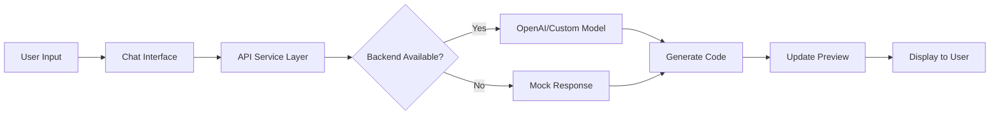

# AI Builder UI - GenAI-Powered React Application

[](https://reactjs.org/)
[](https://vitejs.dev/)
[](https://tailwindcss.com/)
[](LICENSE)

## 🚀 Project Overview

**AI Builder UI** is a cutting-edge GenAI-powered web application that enables users to generate UI components through natural language conversation. Built with React and modern web technologies, it provides an intuitive interface for creating, previewing, and exporting production-ready code.

### ✨ Key Features

- 🤖 **AI-Powered Generation**: Natural language to UI component conversion
- 💬 **Conversational Interface**: Chat-based design workflow
- 📱 **Responsive Preview**: Desktop, tablet, and mobile viewports
- 💻 **Code Export**: View and copy generated React code
- 🎨 **Modern UI**: Beautiful, accessible interface with Framer Motion animations
- 🔄 **Real-time Updates**: Instant preview of generated designs
- 💾 **Project Management**: Save and load project history
- ⚡ **Fast Performance**: Optimized with Vite and React 18
- 🛡️ **Error Handling**: Comprehensive error boundaries and user feedback
- 📦 **Production Ready**: Complete deployment configuration included

---

## 🏗️ Architecture & Tech Stack

### Frontend Stack

| Technology | Version | Purpose |
|------------|---------|---------|
| **React** | 18.2.0 | UI library with hooks and modern features |
| **Vite** | 5.1.6 | Lightning-fast build tool and dev server |
| **Tailwind CSS** | 3.4.1 | Utility-first CSS framework |
| **Framer Motion** | 11.0.8 | Animation library for smooth transitions |
| **Lucide React** | 0.344.0 | Beautiful icon library |

### Code Organization

```
src/
├── components/          # Reusable UI components
│   ├── common/          # Shared components (Button, Input, Toast, etc.)
│   ├── Sidebar/         # Navigation sidebar
│   ├── ChatInterface/   # Chat UI for AI interaction
│   └── PreviewPanel/    # Design preview and code view
├── hooks/               # Custom React hooks
│   ├── useAIChat.js     # AI chat functionality
│   ├── useToast.js      # Toast notifications
│   ├── useDebounce.js   # Input debouncing
│   └── useLocalStorage.js # Persistent storage
├── services/            # API integration layer
│   └── api.js           # API service with mock fallback
├── utils/               # Utility functions
│   ├── cn.js            # Class name merger (Tailwind)
│   └── errorHandler.js  # Centralized error handling
├── config/              # Application configuration
│   └── constants.js     # App constants and defaults
├── App.jsx              # Main application component
└── main.jsx             # Application entry point
```

---

## 🎯 Interview Presentation Guide

### How to Explain This Project

#### 1. **Problem Statement**
"Traditional UI development requires writing code manually. AI Builder solves this by allowing designers and developers to describe what they want in plain English and instantly get production-ready React components."

#### 2. **Technical Highlights**

**a) Component Architecture**
```
✅ Modular Design: Separated concerns (UI, logic, state)
✅ Reusability: Common components used across features
✅ Single Responsibility: Each component has one clear purpose
```

**b) State Management**
```javascript
// Custom hook pattern for clean state management
const {
  messages,      // Chat history
  generatedCode, // AI-generated code
  sendMessage,   // Send user message
  isLoading,     // Loading state
  retry          // Retry failed requests
} = useAIChat();
```

**c) API Integration**
```javascript
// Service layer with mock fallback for development
class APIService {
  async generateUI(prompt, history) {
    // Calls backend GenAI API
  }
}

// Graceful degradation with mock data
const apiService = useMockAPI ? new MockAPIService() : new APIService();
```

**d) Error Handling**
```javascript
// Error Boundary Component catches runtime errors
// Custom APIError class for structured error handling
// Toast notifications for user feedback
```

### 3. **Key Technical Decisions**

| Decision | Reasoning | Benefit |
|----------|-----------|---------|
| **Vite over CRA** | Faster dev server, better DX | 10x faster HMR |
| **Custom Hooks** | Separation of concerns | Testable, reusable logic |
| **Mock API** | Development without backend | Faster iteration |
| **Tailwind CSS** | Utility-first approach | Rapid UI development |
| **Error Boundaries** | Graceful failure handling | Better UX |
| **LocalStorage** | Persistent state | Offline-first approach |

### 4. **GenAI Integration Strategy**



**Backend Integration Points:**
- POST `/api/generate` - Generate UI from prompt
- POST `/api/export` - Export code in various formats
- GET `/api/projects` - Fetch saved projects
- POST `/api/projects` - Save current project

---

## 🚀 Getting Started

### Prerequisites

- Node.js 18+ and npm
- Git

### Installation

1. **Clone the repository**
```bash
git clone <repository-url>
cd ai-builder-ui
```

2. **Install dependencies**
```bash
npm install
```

3. **Configure environment**
```bash
cp .env.example .env
# Edit .env with your configuration
```

4. **Start development server**
```bash
npm run dev
```

5. **Open browser**
```
http://localhost:5173
```

---

## 📝 Available Scripts

| Command | Description |
|---------|-------------|
| `npm run dev` | Start development server |
| `npm run build` | Build for production |
| `npm run preview` | Preview production build |
| `npm run lint` | Run ESLint |

---

## 🔧 Configuration

### Environment Variables

Create a `.env` file in the root directory:

```env
# API Configuration
VITE_API_BASE_URL=http://localhost:3000/api
VITE_USE_MOCK_API=true

# OpenAI Configuration (if using OpenAI directly)
VITE_OPENAI_API_KEY=your_api_key_here

# App Settings
VITE_MAX_MESSAGE_LENGTH=2000
VITE_ENABLE_ANALYTICS=false
```

### Tailwind Configuration

Custom theme colors are defined in `tailwind.config.cjs`:
- Primary: Blue (HSL-based for easy theming)
- Custom CSS variables in `index.css`

---

## 🌐 Deployment

### Deploy to Vercel (Recommended)

1. **Install Vercel CLI**
```bash
npm i -g vercel
```

2. **Deploy**
```bash
vercel --prod
```

3. **Set environment variables** in Vercel dashboard

### Deploy to Netlify

1. **Build the project**
```bash
npm run build
```

2. **Deploy `dist` folder** to Netlify

### GitHub Actions

Automatic deployment is configured in `.github/workflows/deploy.yml`

---

## 🧪 Testing Strategy

### Recommended Testing Approach

1. **Unit Tests** (Jest + React Testing Library)
```bash
npm install --save-dev @testing-library/react @testing-library/jest-dom vitest
```

2. **Integration Tests**
- Test component interactions
- Verify API service layer

3. **E2E Tests** (Playwright/Cypress)
- Test complete user flows
- Verify AI generation workflow

---

## 🔍 Scope of Improvement

### Immediate Enhancements

1. **Backend Integration**
   - Connect to actual GenAI API (OpenAI, Anthropic, etc.)
   - Implement authentication and user sessions
   - Add database for project persistence

2. **Advanced Features**
   - Component library templates
   - Multi-page website generation
   - Export to CodeSandbox/StackBlitz
   - GitHub repository creation

3. **Performance Optimization**
   - Code splitting and lazy loading
   - Service worker for offline support
   - Image optimization

4. **Testing**
   - Unit test coverage (target: >80%)
   - E2E test suite
   - Performance testing

5. **Accessibility**
   - ARIA labels
   - Keyboard navigation
   - Screen reader support

### Long-term Improvements

- **Real-time Collaboration**: Multiple users editing same project
- **Version Control**: Git-like versioning for designs
- **Plugin System**: Extensible architecture for custom generators
- **AI Model Selection**: Choose from multiple AI providers
- **Advanced Code Editing**: In-browser IDE with Monaco Editor

---

## 🎓 Learning Outcomes

### What You'll Learn from This Project

1. **Modern React Patterns**
   - Custom hooks for logic reuse
   - Component composition
   - Error boundaries
   - Performance optimization

2. **API Integration**
   - Service layer architecture
   - Error handling strategies
   - Mock data for development

3. **State Management**
   - useState and useEffect patterns
   - Custom hooks for complex state
   - localStorage integration

4. **UI/UX Best Practices**
   - Responsive design
   - Loading states
   - Error messaging
   - Accessibility

5. **Production Deployment**
   - Environment configuration
   - Build optimization
   - CI/CD pipelines

---

## 📚 Resources & References

- [React Documentation](https://react.dev)
- [Vite Guide](https://vitejs.dev/guide/)
- [Tailwind CSS docs](https://tailwindcss.com/docs)
- [Framer Motion API](https://www.framer.com/motion/)
- [OpenAI API Documentation](https://platform.openai.com/docs)

---

## 🤝 Contributing

Contributions are welcome! Please follow these steps:

1. Fork the repository
2. Create a feature branch (`git checkout -b feature/AmazingFeature`)
3. Commit changes (`git commit -m 'Add AmazingFeature'`)
4. Push to branch (`git push origin feature/AmazingFeature`)
5. Open a Pull Request

---

## 📄 License

This project is licensed under the MIT License.

---

## 🙏 Acknowledgments

- React team for an amazing library
- Tailwind CSS for beautiful utilities
- Framer Motion for smooth animations
- OpenAI for GenAI capabilities

---

## 📧 Contact

For questions or feedback, please open an issue in the repository.

---

**Built with ❤️ using React, Vite, and AI**
